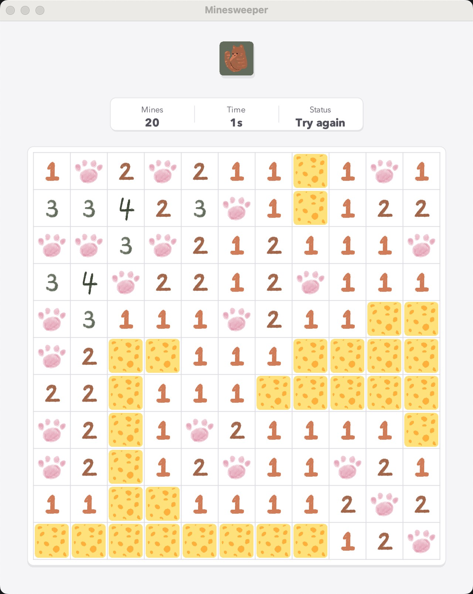

# B-PLUM-EasyCatMinesweeper

A small Java Swing minesweeper game with a cat-themed visual style.

## Screenshot



## Features

- Classic minesweeper-style gameplay
- Cat-themed image assets
- Safe first click
- Left click to open a tile
- Right click to mark or unmark a tile
- Hover and pressed feedback on board tiles
- Status panel with remaining marks, elapsed time, and game state

## Requirements

- Java JDK 17 or later

## Run

Run these commands from the project root:

```bash
javac src/*.java
java -cp src Minesweeper_Win
```

The game loads images from the `pic/` directory, so make sure you run it from the repository root.

## Project Structure

```text
src/   Java source files
pic/   Game image assets
out/   IntelliJ build output
```

## Main Classes

- `Minesweeper_Win`: creates the Swing window and handles mouse events
- `MapTop`: handles the visible tile layer, clicks, status, and win/loss checks
- `MapBottom`: handles the underlying minefield drawing
- `BottomCat`: generates mines
- `Num`: calculates nearby mine numbers
- `GameUtil`: shared game state, constants, images, and UI settings
